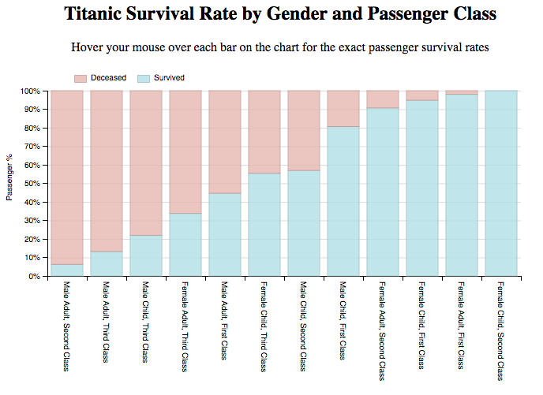
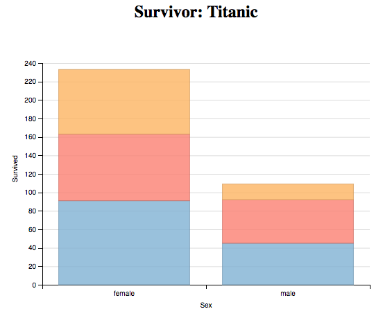
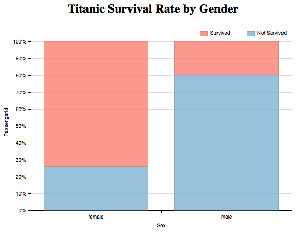
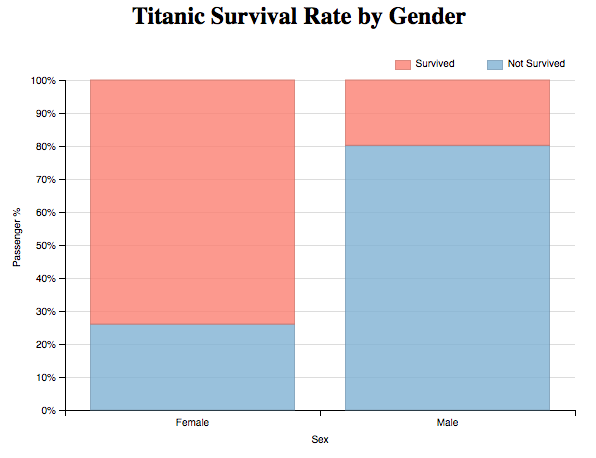

# Data Visualization - Survivor: Titanic
### by Nicholas Cica

## Summary

This project visualizes the Titanic demographics and passenger information. It shows the survival rate by grouping the passengers into subset groups consisting of Age, Gender, and Passenger Class.

The visualization shows that **first and second class female passengers, young and old, had the greatest chance of survival**. Male children from first and second class had the next greatest chance of survival with the female children from third class appearing next.

## Design

I started thinking about my design by exploring the data in excel and I noticed that the data includes the passenger manifest, whether the passenger survived, their gender, age, passenger class and various information about accommodation, cost, etc. I decided that it would be interesting to visualize the relationship between the survivors age, gender and passenger class because it might give us some incite on whether the “women and children first” meme applied to the Titanic.

After working with R, I found **dimple.js** to be similar in its application and thought it would be sufficient in visualizing the Titanic data.

My first throught was to use bar charts since gender is a categorical variable. Initially, just looking at survival by gender was quite limiting and didn’t really tell much.  Therefore, I decided to facet the data by passenger class. This graph showed that about twice as many females as males survived and that a large percentage of 3rd Class male passengers perished.

After the initial feedback (#1), I decided to change the y axis from the number of survivors to a percentage of survivors to better visualize the survival rate.  I changed the labels in the data sheet from a 0-1 to “Survived” and “Not Survived” as well.  

The second round of feedback was much more supportive. I changed a few labels but couldn't figure out how to reorder the bar stack. 

The third round of feedback yielded praise for an easy to understand visualization.  I, again, wasn't able to figure out how to change the color order in my googling research. 

After receiving feedback from my first Udacity reviewer, I decided to make additional changes to the overall design of the graph. First, I expanding the number of categorical variables on the x axis to include age and passenger class, which lead to 12 distinct groups. Next, ordered the stacked bars so that survivors were on the bottom and changed the labels to "Survived" and "Deceased".

I continued to improve the readability by changed the colors associate with Survivors and Deceased to better correlate with the hues expected with good news and bad news. Since the data was starting to look interesting, I reordered the x axes by ascending survival percentage to highlight which groups have a higher chance of survival.  Finally, I added a draw stagger and animation timer to catch the viewers eye as the visualization loads.

In the end, my final design is simple yet conveys the intended message clearly.

## Feedback

**Feedback 1:** First, I noticed that the title does not give a clear understanding of the graph. I wasn’t sure what the different colors represented. I had to mouse over to see something called Pclass. Also, since the Pclass stacks, its hard to compare the Pclass between male and female. Finally, since the female and males each have one bar, the individual totals for each Pclass are hard to count.  Mousing over shows me place the current total on the y axis but not the exact amount.  Honestly, wouldn’t percentage make more sense than number of survivors? I don’t know how many people died.

**Feedback 2:** The mouseover summary is good and the interaction with the graph to show the exact percentages improves readability. However, the term "PassengerID" is confusing and should be changed.  Also, "male" and "female" appear small and should be capitalized.  Finally, why is "Not Survived" on the bottom of the graph? "Survived" should be on the bottom to show a positive message.

**Feedback 3:**  The bar chart is nicely organized and the labels are easy to read. Associating "Survived" with Red and "Not Survived" with blue could be a little confusing. However, in the end I understand the message you are try to convey that the female passengers had a much high survival percentage than the male passengers.

**Feedback 4:**  Change colors in such way that survived will be blue and perished - red, as red is associated with warning in general. As you want to focus on survival data, could you please change perished and survival bars so it will start with survival and perished will be at the top. In this case, the readers can easily see survival rates and they do not need to count it by themselves.

## Final Visualization

## Reflection

After using **dimplejs** I'm much more aware of the limitation of the library out of the box and a little discourage with how much custom code must be written to really customize the visualizations. I mush prefer R's built in functions but can see how the ease of use of dimplejs can be used to make some quick and dirty visualizations without having to learn too much extra code. 

## Resources

[dimplejs](http://dimplejs.org/)

[Vertical Grouped Bar](http://dimplejs.org/examples_viewer.html?id=bars_vertical_grouped)

[dimple.series.addOrderRule(ordering, desc)](https://github.com/PMSI-AlignAlytics/dimple/wiki/dimple.series#addOrderRule)

[dimple.axis.showPercent](https://github.com/PMSI-AlignAlytics/dimple/wiki/dimple.axis#showPercent)

[Dimple.js Axis Labels](http://stackoverflow.com/questions/25774821/dimple-js-axis-labels)

[#e6b6b0 Color Hex](http://www.color-hex.com/color/e6b6b0)

[#b0e0e6 Color Hex Powder Blue](http://www.color-hex.com/color/b0e0e6)